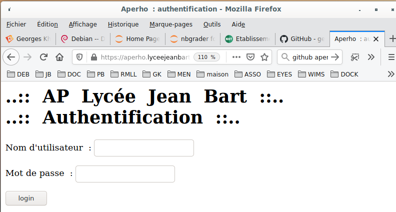
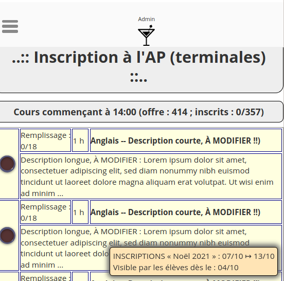
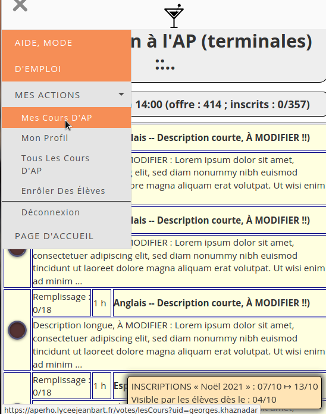
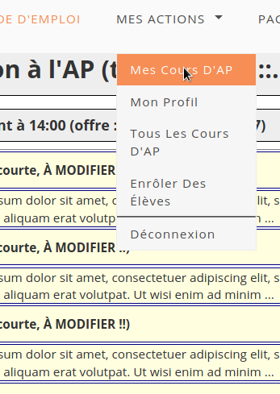
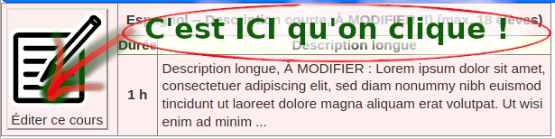
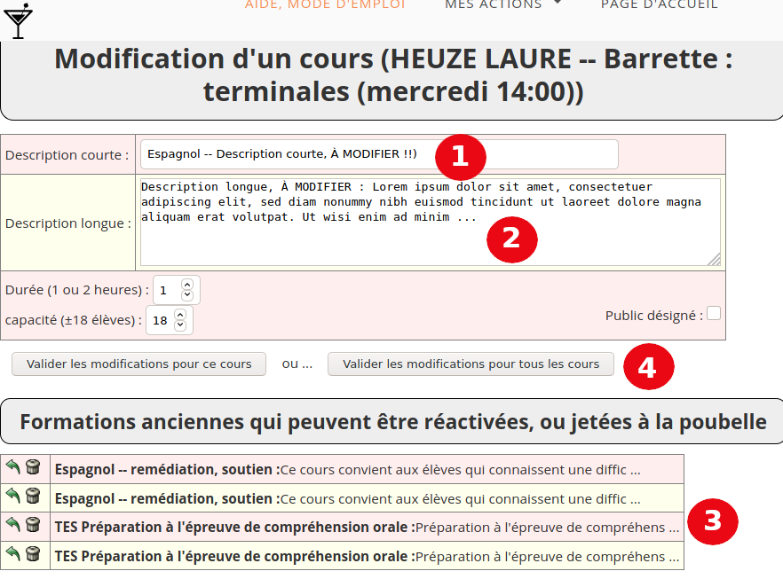

Aperho : le tutoriel des profs
##############################

Préparation, en début d'année
=============================

Au début de l'année scolaire, idéalement, une réunion de concertation
permet de décider des dates de des consultations d'élèves, et de la
politique générale de l'Accompagnement Personnalisé.

Il s'en suit des échéances, telles que, par exemple en 2021 :

 - Avant le 25 septembre, une liste (actualisée) des enseignants qui
   animent des ateliers, qui mentionne le nombre d'intervention de chacun
   est disponible, et éventuellement un commentaire.
   Par exemple, Madame « Laprof Despagnol », deux heures ;
   Monsieur « Leprof Quirassure », une heure, entraînement à la prise de
   parole ; etc.
 - Avant le samedi 2 octobre,  les enseignants inscrivent le thème de
   leur atelier d’AP ( période 2)  sur APERHO.
 - Du jeudi 7 octobre 8H et jusqu’au mercredi 13 octobre 12H, les élèves
   s’inscrivent sur APERHO pour 5 séances : mercredi 10/11- 17/11-24/11-
   2/12-8/12 ( nous  déciderons à la prochaine concertation du contenu de
   la séance du 15/12)

La politique générale, pour les élèves serait alors :

sur APERHO, les élèves ne verront ni le nom de l’enseignant ni l’horaire

  Les élèves s’inscrivent :
    - Soit pour deux créneaux :  ( 2X 1 h) : Choix 1 et  CHOIX 2
      qui correspondent (idéalement) à leurs deux  spécialités
    - Soit pour un créneau :  ( 1X1H) : choix 1 + choix 2 :
      « je ne m’inscris pas à une autre matière »
      
À partir du mercredi 13 octobre  13H et avant le vendredi 15 octobre 12H,
les inscriptions des élèves dans Pronote sont faites, en plusieurs vagues,
certains enseignants structurant les vœux des élèves avant les autres,
pour éviter au mieux des situations de blocage.

Les travaux échéant aux professeurs, pour renseigner Aperho
===========================================================

Entre le 20 septembre et le 25 septembre, les responsables d'Aperho
vérifient que chaque professeur a bien un compte dans l'annuaire Kwartz
(réutilisé par Aperho), et inscrivent les collègues de la liste
avec le statut « Professeur ».

Ils inscrivent aussi les classes de terminales concernées dans la « barrette »
d'Apérho et créent la session en tenant compte des dates pour
la visibilité par les élèves.

Inscription du thème de l'atelier
---------------------------------

La semaine du 2 octobre, 27 septembre au 2 octobre, chaque intervenant de
l'AP doit se connecter une fois à https://aperho.lyceejeanbart.fr

|image1|

Après authentification (prenom.nom/mot de passe [des ordinateurs du lycée]),
On arrive à une page qui contient les « cours d'AP », avec des intitulés
provisoires.

|image2|

Il faut obligatoirement modifier les intitulés
----------------------------------------------

Et ce, 48 heures avant que les élèves ne soient autorisés à voir la page.

Comment faire :
^^^^^^^^^^^^^^^

  - on déroule le menu (les trois traits blanc, en haut à gauche si l'écran
    est étroit comme celui d'un téléphone), puis
    **MES ACTIONS ---> Mes Cours D'AP**

.. list-table:: Édition de « Mes Cours D'AP »
   :header-rows: 1

   * - Écran étroit
     - Écran large
   * - |image3|
     - |image4|

Dans le contexte de « Mes Cours D'AP »
^^^^^^^^^^^^^^^^^^^^^^^^^^^^^^^^^^^^^^

Chaque professeur a deux lignes qui le concernent : on clique sur une
des deux lignes, par exemple celle du premier cours. Des informations
plus précises sont alors dépliées.

À ce point-là, sans hésitation aucune,
**ON CLIQUE SUR LE BOUTON ÉNORME SYMBOLISANT UN CRAYON SUR UN BLOC-NOTES**

|image5|

On obtient alors le **dialogue d'édition de cours**, voir la copie d'écran
ci-dessous :

|image6|

Que fait-on alors ?
^^^^^^^^^^^^^^^^^^^

 1. On modifie la description courte
 2. On modifie la description longue
 3. Ou alors, pour les experts : Aperho se souvient peut-être d'intitulés
    que vous avez saisis dans le passé : il est possible de les réactiver
    (ou de les supprimer définitivement)
 4. On valide alors.

    - soit pour une heure de cours seulement
    - soit pour tous les cours à la fois

En revenant ensuite à *MES ACTIONS ---> Mes Cours D'AP*, on peut voir
le résultat et modifier l'autre cours, si on n'a pas appliqué l'intitulé
à tous le cours.

Et c'est tout, c'est fini
=========================

Pour avoir le sentiment du devoir accompli, il est possible de revenir à la
page d'accueil du site https://aperho.lyceejeanbart.fr/

On y observe alors les modification qu'on y a faites et que les élèves
verront bientôt.

Il est toujours possible de revenir sur un choix. Mais quand les élèves
commencent à participer au « vote », les intitulés ne sont pas modifiables.

À propos de ce document
#######################

Ce document est modifiable, si vous voyez comment l'améliorer, n'hésitez pas !

Sa source est téléchargeable depuis
https://raw.githubusercontent.com/georgesk/aperho/master/tutos/profs.rst

Et si vous voulez, vous verrez que la structure du document se modifie
très simplement avec un éditeur de texte ordinaire.

   

   

   

	 

   

   
   
